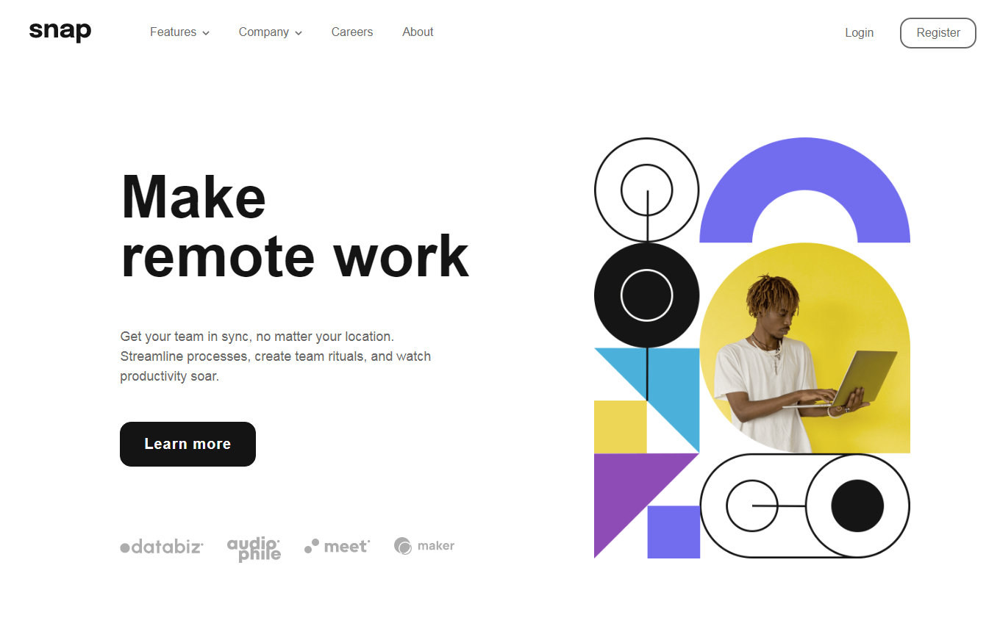
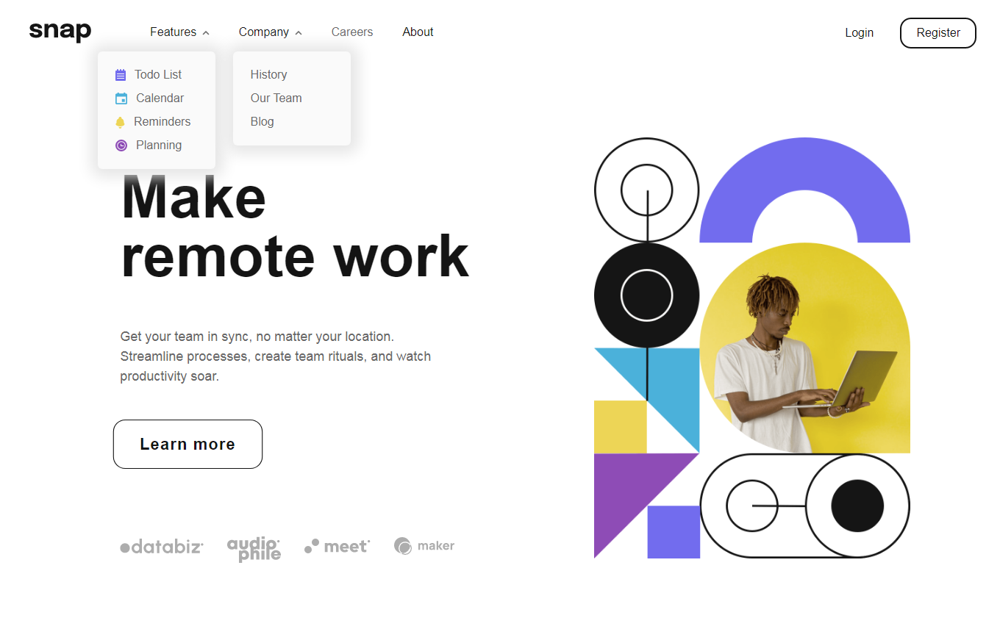
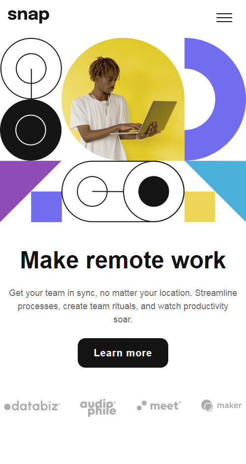
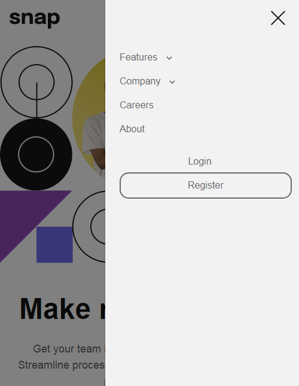
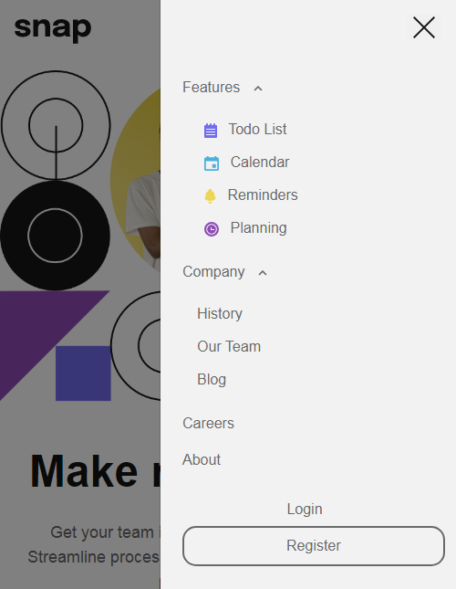

# Frontend Mentor - Intro section with dropdown navigation solution

This is a solution to the [Intro section with dropdown navigation challenge on Frontend Mentor](https://www.frontendmentor.io/challenges/intro-section-with-dropdown-navigation-ryaPetHE5). Frontend Mentor challenges help you improve your coding skills by building realistic projects. 

## Table of contents

- [Overview](#overview)
  - [The challenge](#the-challenge)
  - [Screenshot](#screenshot)
  - [Links](#links)
- [My process](#my-process)
  - [Built with](#built-with)
  - [What I learned](#what-i-learned)
  - [Continued development](#continued-development)
  - [Useful resources](#useful-resources)
- [Author](#author)

## Overview

### The challenge

Users should be able to:

- View the relevant dropdown menus on desktop and mobile when interacting with the navigation links
- View the optimal layout for the content depending on their device's screen size
- See hover states for all interactive elements on the page

### Screenshot







### Links

- Solution URL: [solution url](https://github.com/DevouraStudio/Intro-Section-Project)
- Live Site URL: [live site url](https://devourastudio.github.io/Intro-Section-Project/)

## My process

### Built with

- Semantic HTML5 markup
- Flexbox
- Mobile-first workflow
- CSS media queries
- [Bootstrap](https://getbootstrap.com/) - CSS framework

### What I learned

"As With Previous Projects, This One Was Also Challenging For Me; However, It Differed From Earlier Assignments In Terms Of Both Complexity And Realism. This Project Focused Specifically On Designing And Coding A Landing Page.

Throughout The Development Process, I Made Greater Use Of Bootstrap Than Usual In Order To Streamline Implementation And Improve Overall Consistency. Bootstrap Performed Reliably And Significantly Accelerated Both The Workflow And The Successful Completion Of The Project.

One Of The Most Engaging—And Challenging—Parts Of This Assignment Was Establishing The Correct HTML Structure. In Particular, Within Key Sections Such As The Main Content Area, The Way HTML Was Organized Had A Direct Impact On The Final Visual Layout And Presentation.

Regarding Responsiveness, Many Aspects Of The Design Were Implemented Effectively With The Support Of Bootstrap. 
That Said, Some Sections Remained Difficult To Achieve Perfectly And, In Certain Cases, Were Not Fully Feasible Within The Available Constraints.

Unlike Some Earlier Projects, I Applied A Mobile-First Design Workflow And Followed Its Core Principles. Overall, Although This Project, Like Others, Presented Its Own Difficulties And Challenges, I Believe It Can Be Especially Useful As A Practical Experience For Designing And Building Modern Websites."

```html
<nav class="navbar bg-body-light navbar-expand-lg pt-3 pt-lg-2 px-1">
		<div class="container-fluid">
			</img>
			<button class="navbar-toggler border border-0" type="button" data-bs-toggle="offcanvas"
				data-bs-target="#offcanvasNavbar" aria-controls="offcanvasNavbar" aria-label="Toggle navigation">
				
			</button>
			<div class="offcanvas offcanvas-end" tabindex="-1" id="offcanvasNavbar"
				aria-labelledby="offcanvasNavbarLabel">
				<div class="offcanvas-header d-flex justify-content-end d-lg-none">
					<button type="button" data-bs-dismiss="offcanvas" aria-label="Close"
						class="border border-0 d-lg-none">
						
					</button>
				</div>
				<div class="offcanvas-body ps-4">
					<ul class="navbar-nav justify-content-start flex-grow-1 pe-3">
						<li class="nav-item dropdown pb-lg-1 me-lg-4">
							<a class="nav-link dropdown-toggle" href="#" role="button" data-bs-toggle="dropdown"
								data-bs-auto-close="inside" aria-expanded="false" id="features">
								Features
							</a>
							<ul class="dropdown-menu dropdown-menu-end border border-0" id="features-dropdown-menu">
								<li><a class="dropdown-item mb-1 mb-lg-0" href="#">
										
										<span>Todo List</span>
									</a></li>
								<li><a class="dropdown-item mb-1 mb-lg-0" href="#">
										
										<span>Calendar</span>
									</a></li>
								<li><a class="dropdown-item mb-1 mb-lg-0" href="#">
										
										<span>Reminders</span>
									</a></li>
								<li><a class="dropdown-item mb-1 mb-lg-0" href="#">
										
										<span>Planning</span>
									</a></li>
							</ul>
						</li>
						<li class="nav-item dropdown pb-lg-1 me-lg-4">
							<a class="nav-link dropdown-toggle" href="#" role="button" data-bs-toggle="dropdown"
								data-bs-auto-close="inside" aria-expanded="false">
								Company
							</a>
							<ul class="dropdown-menu border border-0" id="company-dropdown-menu">
								<li><a class="dropdown-item mb-1 mb-lg-0" href="#">History</a></li>
								<li><a class="dropdown-item mb-1 mb-lg-0" href="#">Our Team</a></li>
								<li><a class="dropdown-item mb-1 mb-lg-0" href="#">Blog</a></li>
							</ul>
						</li>
						<li class="nav-item pb-lg-1 me-lg-4">
							<a class="nav-link" aria-current="page" href="#" id="careers">Careers</a>
						</li>
						<li class="nav-item pb-lg-1">
							<a class="nav-link" href="#" id="about">About</a>
						</li>
					</ul>
					<ul class="navbar-nav justify-content-end flex-grow-1 pe-3">
						<li class="nav-item text-center  mt-3 mt-lg-0 pb-lg-1 me-lg-4">
							<a class="btn border border-0" href="#" id="login">Login</a>
						</li>
						<li class="nav-item text-center" id="register-navitem">
							<a class="btn" href="#" id="register">Register</a>
						</li>
					</ul>
				</div>
			</div>
		</div>
	</nav>
```
```css
.dropdown-toggle::after {
	background-image: url('./SVG-Files/icon-arrow-down.svg');
	background-repeat: no-repeat;
	background-size: contain;
	width: 10px;
	height: 10px;
	border: none;
	vertical-align: middle;
	margin-left: 10px;
	margin-top: 5px;
}

@media (min-width: 992px) {
	main {
		padding-top: 5rem;
	}

	.dropdown-toggle::after {
		margin-left: 3px;
	}

	.dropdown-menu {
		background-color: hsl(0, 0%, 98%);
		box-shadow: 1px 1px 20px 10px hsl(0, 0%, 90%);
	}

	.dropdown-toggle.show {
		color: hsl(0, 0%, 8%) !important;
	}

	#features-dropdown-menu.show {
		padding: 1rem 0.5rem 1rem 0;
		display: flex;
		flex-direction: column;
		justify-content: start;
	}

	#company-dropdown-menu.show {
		padding: 1rem 0 1rem 0.5rem;
	}

	#register {
		padding: 7px 1.25rem;
	}

	#login {
		padding-top: 9px;
	}

	#main-images-section {
		padding-right: 9vw;
		padding-left: 5vw;
	}

	#content-section {
		padding-right: 5vw;
		padding-left: 12vw;
		height: 573px;
	}

	h1 {
		font-size: 5rem;
		line-height: 5rem;
	}

	#button-div {
		margin-top: 2rem !important;
	}

	#client-row {
		margin-top: 7vw;
		gap: 2rem;
	}
}
```

### Continued development

"The Areas That I Intend To Further Develop With Greater Efficiency And Precision Through This Project Include The Following:

First, I Aim To Place Increased Emphasis On The Proper Use Of Semantic HTML. In Certain Projects And Specialized Design Structures, Semantic Markup Plays A Critical Role In Enhancing Code Readability, Maintainability, And Overall Project Comprehension. Strengthening My Expertise In This Area Will Contribute Significantly To Writing Cleaner And More Structured Code.

Second, I Plan To Expand My Utilization Of CSS Frameworks, Particularly Bootstrap. The Strategic Use Of Such Frameworks Streamlines The Development Process By Reducing The Amount Of Custom CSS Required, Thereby Increasing Productivity And Consistency. As Previously Mentioned, I Leveraged Bootstrap Extensively In This Project, And It Demonstrated Strong Reliability And Efficiency. Additionally, I Am Actively Exploring The Tailwind CSS Framework And Intend To Incorporate It Into Future Projects To Achieve More Optimized And Scalable Styling Solutions.

Finally, I Plan To Establish A Dedicated Professional Account For Managing More Complex And Technically Challenging Projects. This Initiative Will Allow Me To Continuously Refine My Skills And Expand My Practical Experience Within The Field. Furthermore, It Is Essential To Acknowledge The Significant Role Of The JavaScript Programming Language In Modern Web Development. A Deeper And More Focused Engagement With JavaScript Will Be Crucial For Building More Dynamic, Interactive, And Feature-Rich Applications."

### Useful resources

- [MDN](https://developer.mozilla.org/en-US/) - "During This Project, I Frequently Referred to the Mozilla Developer Network (MDN) Website as a Trusted Resource for Learning and Clarifying HTML, CSS, and JavaScript. MDN Provided Clear Documentation, Practical Examples, and Best Practices That Helped Me Solve Challenges More Efficiently. Using MDN Not Only Improved My Technical Accuracy but Also Strengthened My Confidence in Applying Modern Web Standards to My Work."

- [ChatGPT](https://www.chatgpt.com/) - "Throughout This Project, I Benefited Greatly From the Guidance and Support Provided by ChatGPT. From Explaining Complex HTML, CSS, and Bootstrap Concepts to Offering Practical Code Examples and Debugging Advice, ChatGPT Helped Me Overcome Challenges More Efficiently. It's Clear Explanations and Creative Suggestions Played a Key Role in Improving My Skills, Building My Confidence, and Ensuring the Project’s Overall Quality."

- [Bootstrap](https://getbootstrap.com/) - "In This Project, I Utilized Bootstrap to Streamline the Design Process and Enhance the Visual Appeal of My Pages. By Leveraging Bootstrap’s Pre-Built Components, Utility Classes, and Customization Options, I Was Able to Maintain Consistent Styling, Organize Content Effectively, and Apply Modern Web Design Techniques More Efficiently. Using Bootstrap Helped Me Focus on Creativity and Attention to Detail While Building the Project."

## Author

- Website - [DevouraStudio](https://www.devoura.ir)
- Frontend Mentor - [@DevouraStudio](https://www.frontendmentor.io/profile/DevouraStudio)
- Github - [@DevouraStudio](https://www.github.com/DevouraStudio)
- Codepen - [@DevouraStudio](https://www.codepen.io/DevouraStudio)